# 22 Best AI Voice Generator Tools in 2025

Tired of robotic, clunky text-to-speech that makes your content feel lifeless? Finding the right tool for natural-sounding voiceovers can feel like a chore, especially when you need high-quality audio for videos, podcasts, or training materials without the Hollywood budget. This guide cuts through the noise, presenting the top AI voice generator platforms that deliver incredibly realistic voices, making your projects more engaging and professional.

## **[Play.ht](https://play.ht)**

Play.ht offers one of the most extensive and versatile AI voice generation platforms, making it a go-to for creators and businesses needing a wide range of options. It’s designed to transform text into lifelike speech for everything from video narration to e-learning modules.

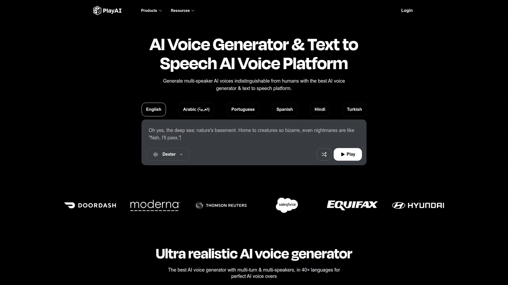

**Core Features & Highlights:**
* **Massive Voice Library:** It boasts an impressive collection of over 800 AI voices spanning more than 140 languages and accents, providing unparalleled variety.
* **Advanced Voice Control:** Users can fine-tune every aspect of the audio, including pitch, speed, emphasis, and emotional styles, to create highly expressive and human-like narration. The platform also supports SSML for granular control.
* **Voice Cloning:** Play.ht allows you to create a digital replica of your own voice with high accuracy, capturing your unique intonation and rhythm for personalized projects.
* **Multi-Speaker Capability:** The studio editor supports creating dialogues and conversations by using multiple voices within a single audio file, which is perfect for podcasts or character-driven content.

While the platform is incredibly powerful, some user reviews from 2025 note occasional service inconsistencies and advise carefully reviewing billing terms on subscription plans.

## **[Murf.ai](https://murf.ai)**

Murf.ai is a comprehensive AI voice generator that’s particularly well-suited for creators and corporate teams who need to produce studio-quality voiceovers without the hassle. It simplifies the entire process from script to sound.

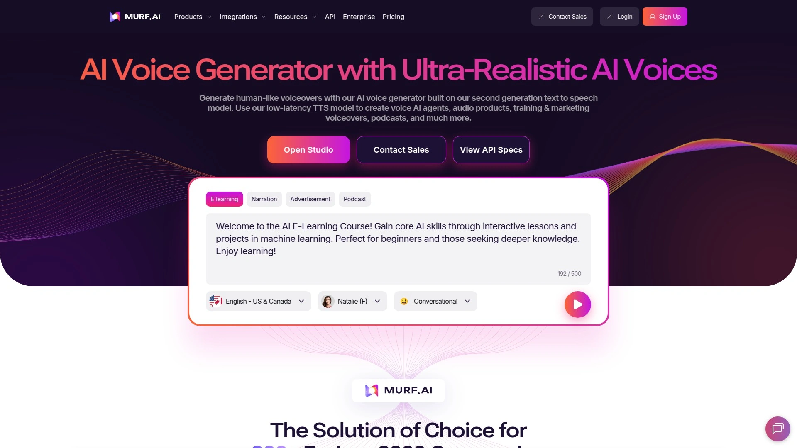

**What sets it apart:**
* Features a library of over 120 natural-sounding voices in more than 20 languages.
* Includes a collaborative workspace, allowing teams to work together on projects seamlessly.
* Offers powerful integrations with popular creative tools like Canva, PowerPoint, and Adobe Audition, streamlining the content creation workflow.
* You can sync voiceovers with video directly within the platform, eliminating the need for third-party editing software.

## **[LOVO](https://lovo.ai)**

LOVO positions itself as a next-generation AI voice generator with a strong focus on emotionally expressive and realistic voices, trusted by over 2 million professionals. Its platform, Genny, is packed with features for video creators and marketers.

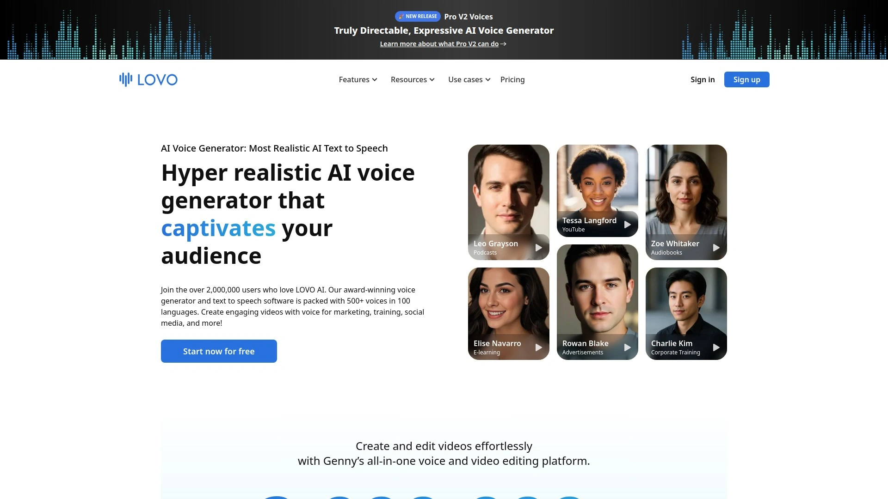

**Key aspects:**
* Provides a large selection of over 180 voices in 33 languages, capable of conveying a wide range of emotions.
* Its AI-powered tools allow for detailed customization of pitch, speed, and tone to perfectly match your content's mood.
* Ideal for creating engaging audio for advertisements, audiobooks, and podcasts where emotional connection is key.

## **[Speechify](https://speechify.com)**

Speechify is a leading platform that excels at converting text from almost any source into audible speech, making it a powerhouse for productivity and accessibility. With a massive user base of over 50 million, it's a highly polished and reliable tool.

**Why it's popular:**
* **Cross-Platform Availability:** Works seamlessly as an app on iOS and Android, and as a browser extension for Chrome and Safari.
* **High-Quality Voices:** Offers a wide selection of natural-sounding voices in over 60 languages.
* **Productivity Focused:** It can read articles, documents, emails, and PDFs, helping users consume content faster and on the go.

## **[ElevenLabs](https://elevenlabs.io)**

ElevenLabs is renowned for its state-of-the-art AI that produces incredibly lifelike and natural-sounding speech. It's a favorite among creators who prioritize audio quality above all else for their projects.

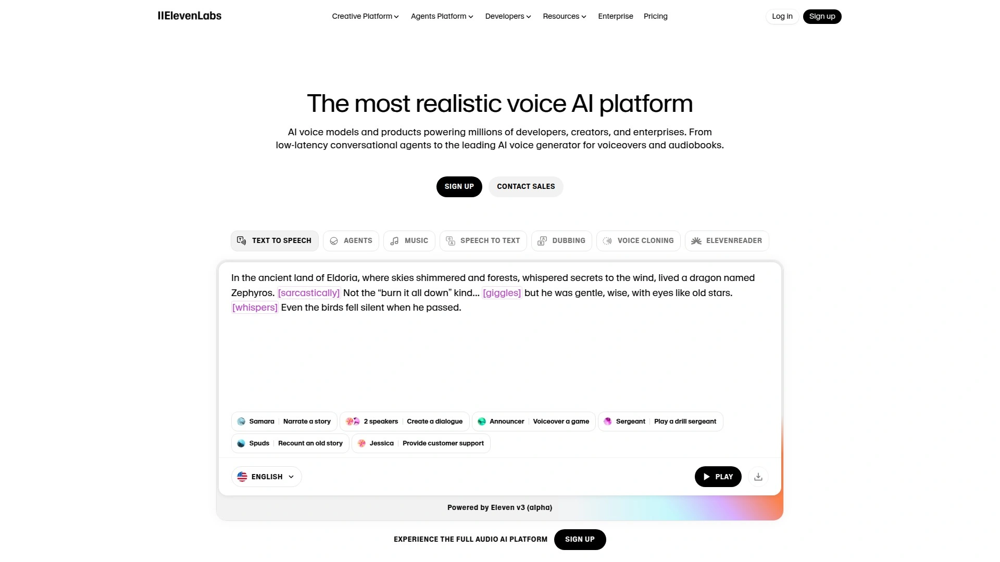

**Noteworthy features:**
* **Superior Realism:** Widely regarded for generating some of the most human-like voices available, with rich intonation and clarity.
* **Voice Cloning & Design:** Allows users to clone their own voice or design entirely new, unique voices from scratch.
* **Multilingual Support:** The platform supports a growing number of languages, making it versatile for global content creation.

## **[Resemble AI](https://resemble.ai)**

Resemble AI is an enterprise-grade platform built for teams that require a high degree of control, security, and quality in their voice applications. It offers a suite of powerful tools for advanced voice generation.

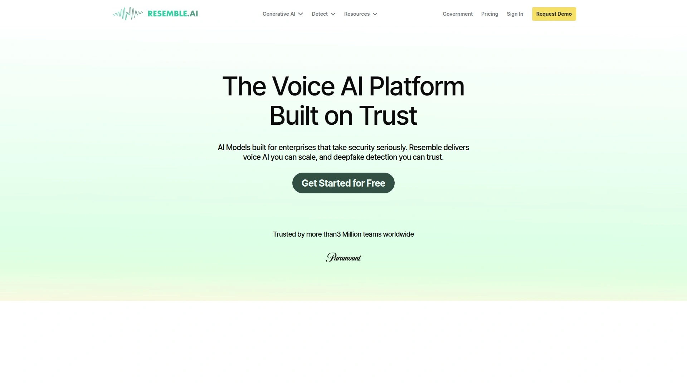

**Highlights:**
* **Real-Time Speech-to-Speech:** Enables dynamic voice transformations on the fly.
* **Rapid Voice Cloning:** Clone a voice with just a few seconds of audio.
* **Security Features:** Includes neural watermarking and deepfake detection to protect your voice assets.
* Ideal for high-stakes use cases in gaming, marketing, and interactive media.

## **[WellSaid Labs](https://www.wellsaidlabs.com)**

WellSaid Labs focuses on producing exceptionally authentic and realistic AI voices that are perfect for corporate training, advertising, and other professional applications. It's a great choice for those who need polished, brand-consistent audio.

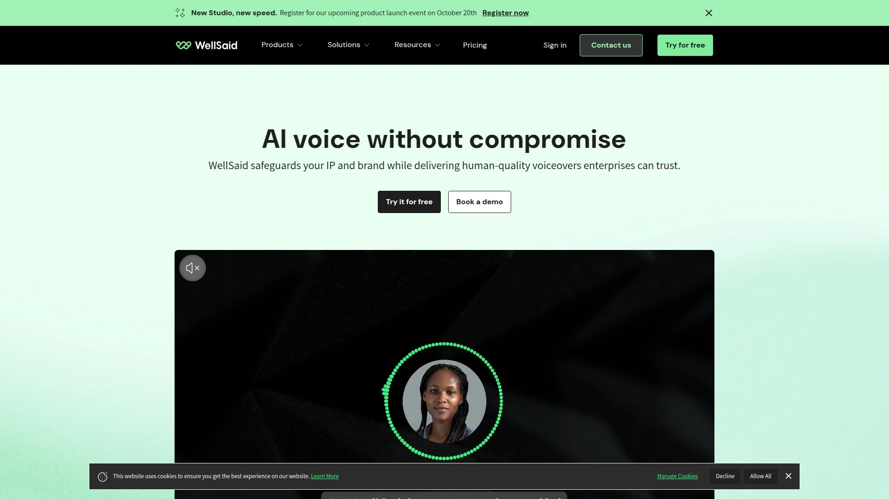

**Core strengths:**
* Provides a curated library of over 120 authentic-sounding voices.
* Offers a free trial to test its studio and API capabilities.
* Integrates with popular tools like Adobe Premiere, Canva, and Adobe Express.

## **[Listnr](https://www.listnr.tech)**

Listnr has gained significant attention for its powerful and user-friendly platform, even winning accolades on ProductHunt. It’s used by over 2.5 million people and offers a massive library of voices.

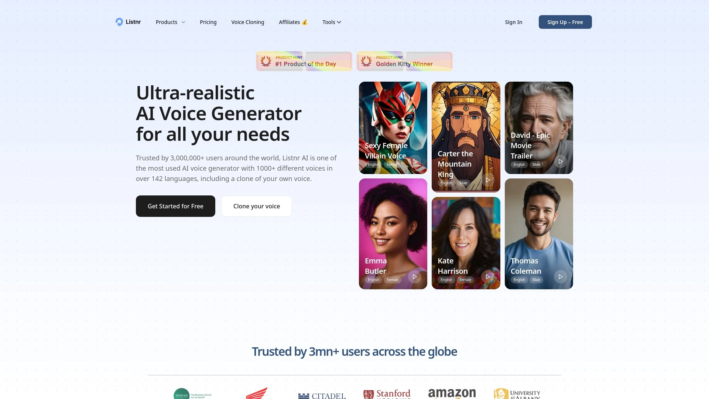

**Key features:**
* An extensive selection of over 1,000 different voices in 142 languages.
* Allows users to create AI-powered podcasts and convert text into videos.
* Offers voice cloning and API access for integrating text-to-speech into other apps.

## **[NaturalReader](https://www.naturalreaders.com)**

NaturalReader is a straightforward and highly effective tool designed for accessibility and personal productivity. It excels at reading various types of text aloud with natural-sounding AI voices.

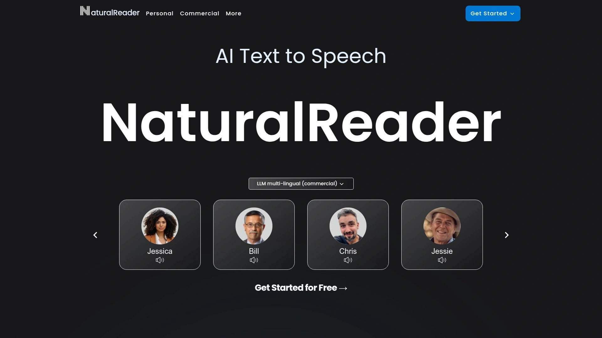

**Why it's useful:**
* **OCR Technology:** It can read text from scanned documents and images, not just digital files.
* **Cloud-Based:** Access your documents and listen to them on any device.
* **Browser Extension:** Makes it easy to listen to web pages, articles, and emails directly in your browser.

## **[Deepgram](https://deepgram.com)**

Deepgram is a developer-focused platform that provides powerful APIs for both speech-to-text and text-to-speech. It’s built for scale, making it ideal for integrating voice AI into applications that require real-time performance and high accuracy.

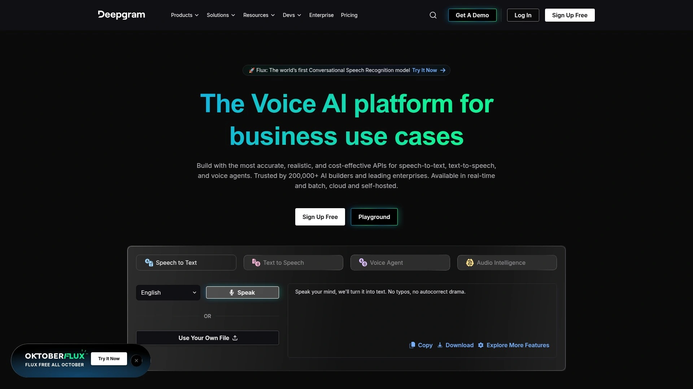

**Best for:**
* Developers and businesses needing to build custom voice solutions.
* Real-time applications, voice agents, and large-scale audio generation.
* Unifying transcription and voice generation into a single, efficient API.

## **[Readspeaker](https://www.readspeaker.com)**

Readspeaker is a trusted independent digital voice partner that focuses on providing ethical and secure text-to-speech solutions. They build all their voices in-house using authorized recordings, ensuring high quality and data privacy.

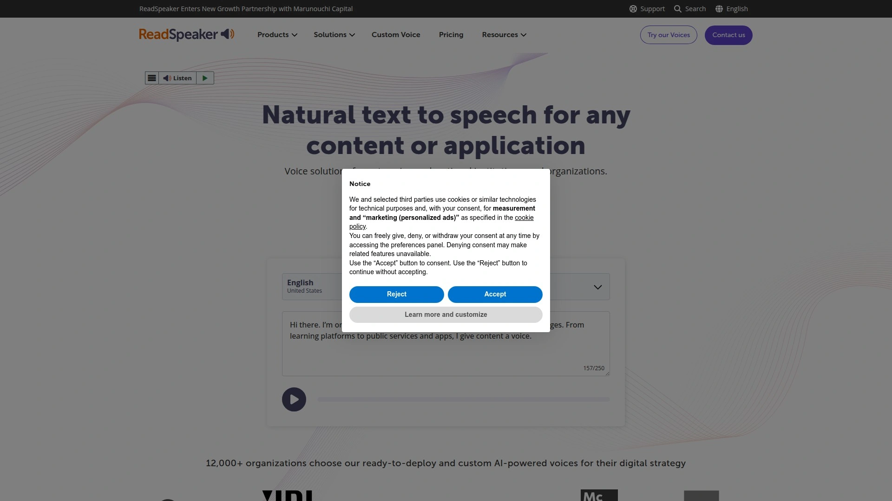

**Highlights:**
* **Ethical AI:** Prioritizes data security and works to prevent unauthorized use of its technology.
* **Platform Agnostic:** Deploy your chosen voice across any platform—cloud, on-premise, or embedded—via plugins and APIs.
* Offers a catalog of over 200 lifelike voices in more than 50 languages.

## **[HeyGen](https://www.heygen.com)**

While primarily known for its AI video avatars, HeyGen also provides powerful voice cloning and text-to-speech capabilities. It’s an excellent choice for marketers and social media managers who need to create video content with customized audio quickly.

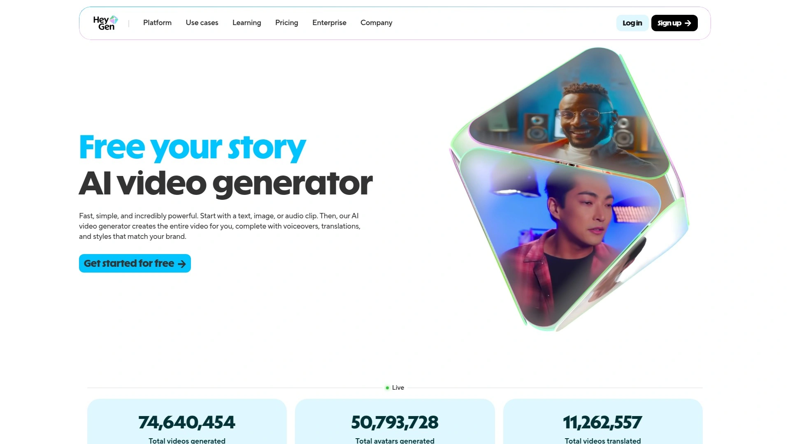

**Key aspects:**
* Generates realistic AI avatars that can be paired with cloned or stock voices.
* Paid plans often focus on high-volume or unlimited video generation, making it cost-effective for agencies.
* A strong all-in-one tool for turning text into a complete audio-visual experience.

## **[Synthesia](https://www.synthesia.io)**

Synthesia is a leader in AI video generation and features integrated voice cloning. It's geared more towards enterprise clients and is perfect for creating professional training videos, corporate communications, and marketing content with custom avatars and voices.

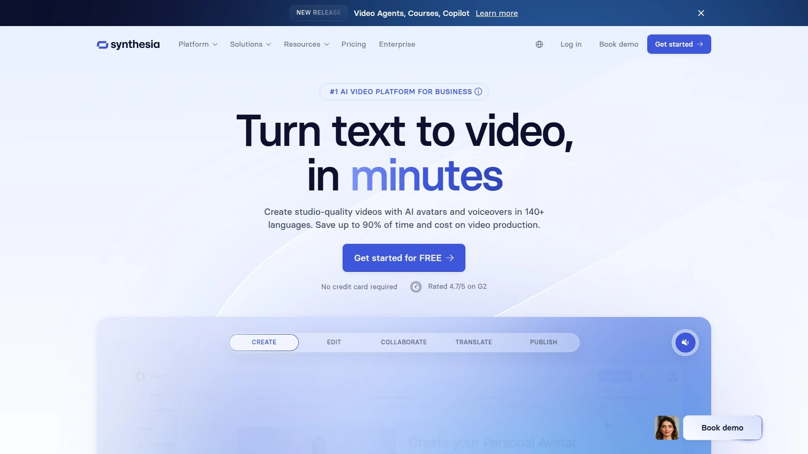

**Why choose Synthesia:**
* Excellent for creating AI avatar videos with high-quality voiceovers.
* Appeals to corporate and enterprise users, who can create training materials at scale.
* Combines both video and audio generation in a single, polished platform.

## **[Amazon Polly](https://aws.amazon.com/polly)**

Part of the Amazon Web Services (AWS) suite, Amazon Polly is a text-to-speech service that uses advanced deep learning technologies to synthesize speech that sounds like a human voice. It's a scalable and reliable option for developers integrating voice into their applications.

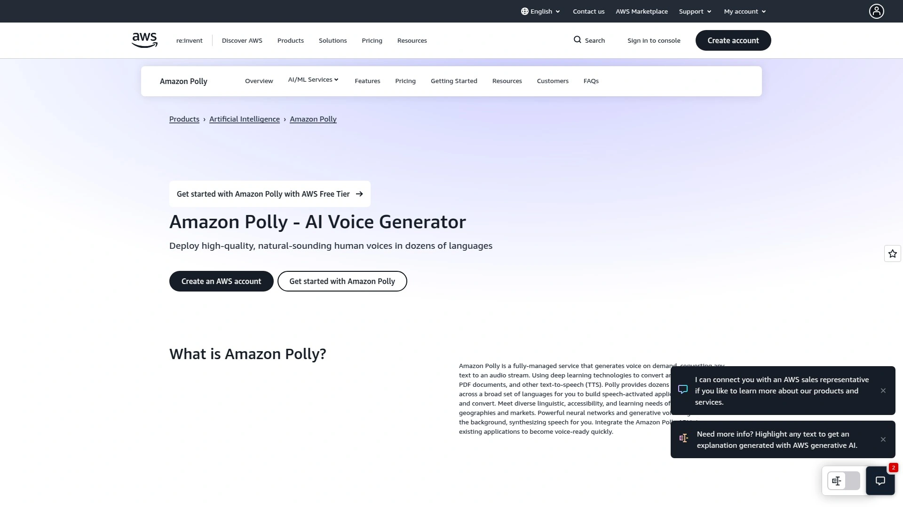

**Best for:**
* Developers already working within the AWS ecosystem.
* Applications requiring a pay-as-you-go model for scalability.
* Creating speech-enabled products and services with a variety of languages and voices.

## **[Microsoft Azure AI Speech](https://azure.microsoft.com/en-us/products/ai-services/ai-speech)**

Microsoft Azure’s text-to-speech service is a robust, enterprise-grade solution known for its high-quality neural voices. Many other TTS platforms are built on top of Azure's technology, which speaks to its reliability and quality.

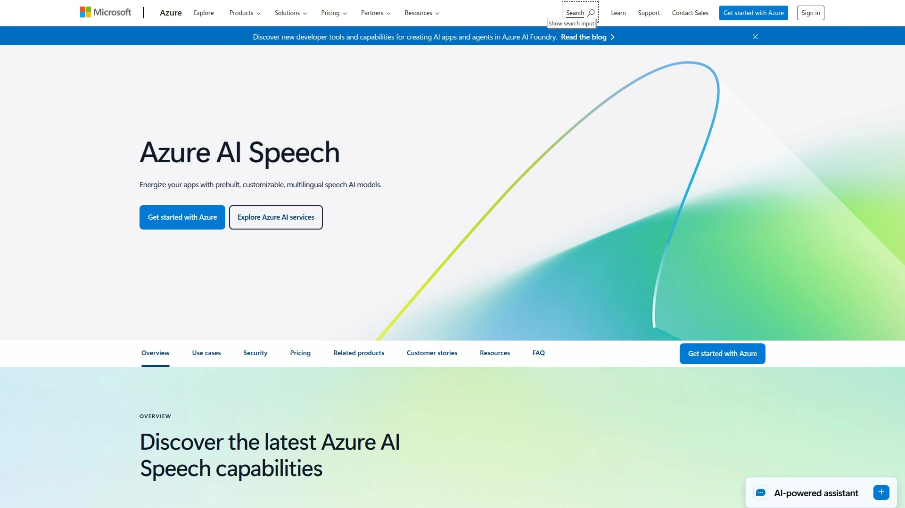

**Highlights:**
* Offers incredibly natural-sounding voices with human-like intonation.
* Provides customizable voice options, including speaking styles, rate, and pitch.
* A go-to choice for businesses that need a dependable and scalable voice solution integrated with other Microsoft services.

## **[Descript](https://www.descript.com)**

Descript is an all-in-one audio and video editor that functions as easily as a word processor. It includes a powerful text-to-speech feature called "Overdub," which allows you to create a realistic clone of your voice to generate audio.

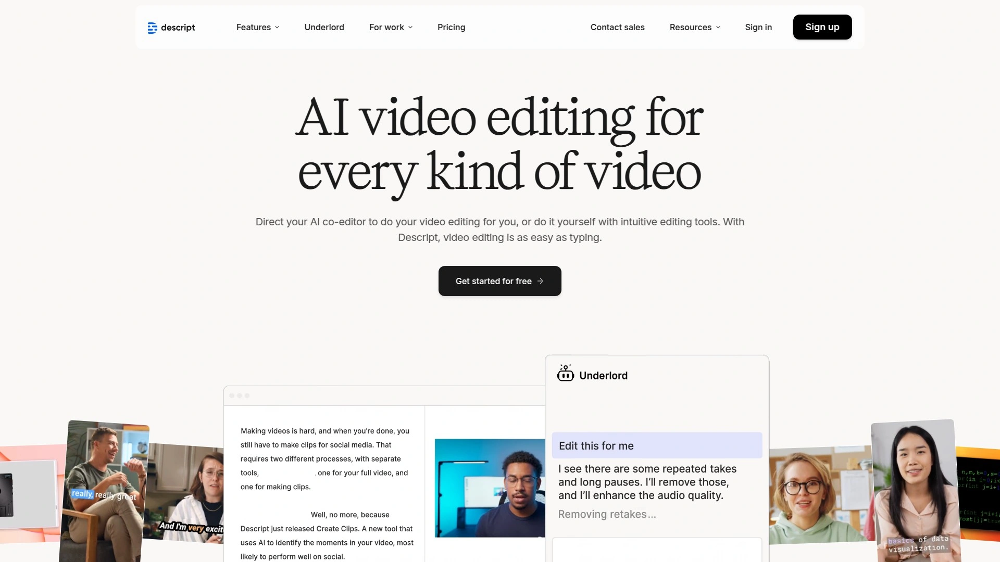

**What makes it unique:**
* **Edit Audio by Editing Text:** Correcting audio mistakes is as simple as correcting a typo in the transcript.
* **Overdub Voice Cloning:** Create a high-quality clone of your voice to generate new words or sentences seamlessly.
* A perfect tool for podcasters, video creators, and anyone who does a lot of audio editing.

## **[Acapela Group](https://www.acapela-group.com)**

Acapela Group specializes in creating personalized digital voices for a wide range of applications, from public transport announcements to assistive technology. They offer a diverse portfolio of voices and focus on creating unique voice personas for brands.

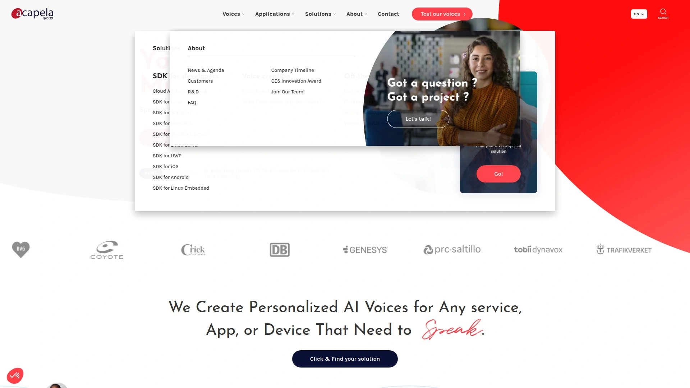

**Key features:**
* A library of over 200 voices in more than 30 languages.
* Specializes in creating custom, branded voices that reflect a company's personality.
* Strong presence in accessibility and transport sectors.

## **[Cognigy](https://www.cognigy.com)**

Cognigy is an enterprise-level conversational AI platform designed for building sophisticated voice and chatbots. It’s built for global organizations that need to automate customer interactions across multiple channels with high reliability.

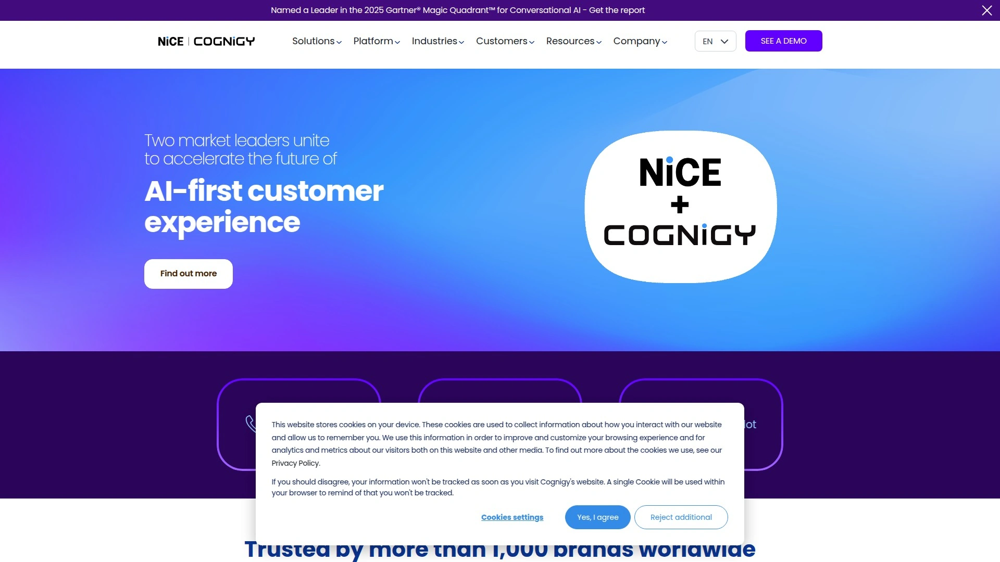

**Highlights:**
* **No-Code Builder:** Features an intuitive interface for designing complex conversation flows without writing code.
* **Omnichannel Deployment:** Integrates with leading contact center platforms like Genesys and Avaya for seamless voicebot implementation.
* Highly scalable and customizable for complex enterprise workflows.

## **[Voiceflow](https://www.voiceflow.com)**

Voiceflow is a collaborative platform for designing, prototyping, and launching voice and chat assistants. It’s an excellent tool for teams that want to build and test conversational experiences before deploying them.

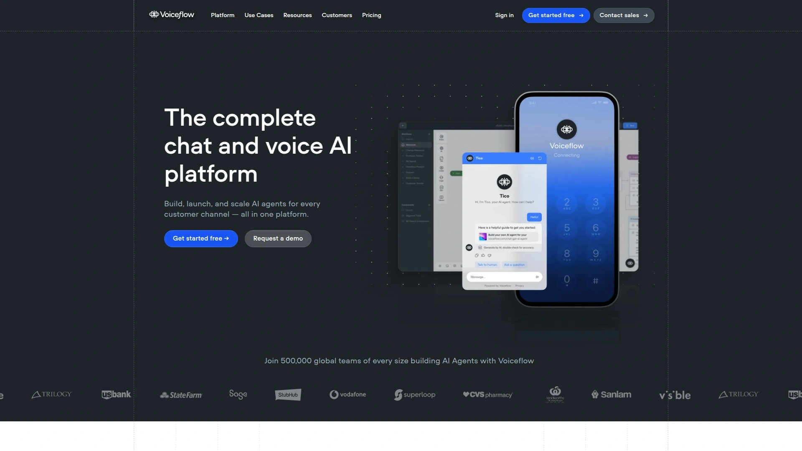

**Best for:**
* Designers and product teams who want to prototype conversational AI without coding.
* Its drag-and-drop builder makes it easy to map out conversation flows.
* Supports multiple channels, including voice assistants like Alexa and Google Assistant, as well as chat.

## **[Creatify.ai](https://creatify.ai)**

Creatify.ai is an AI-driven platform that focuses on generating marketing content, including voiceovers and videos, from simple text prompts. It is designed to help marketers and advertisers create high-quality ad creatives quickly and efficiently.

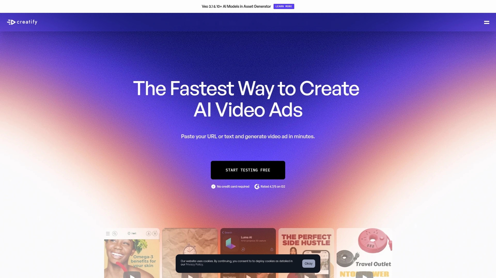

**Why it's useful for marketers:**
* Turns product URLs or text descriptions into engaging video ads.
* Includes AI voice generation and cloning technology specifically for marketing content.
* Simplifies the creative process for social media ads and promotional videos.

## **[AITextSpeak](https://aitextspeak.com)**

AITextSpeak is a straightforward text-to-speech platform that offers a simple way to convert text into audio. It is a practical tool for anyone needing a quick and easy solution for generating voiceovers without a steep learning curve.

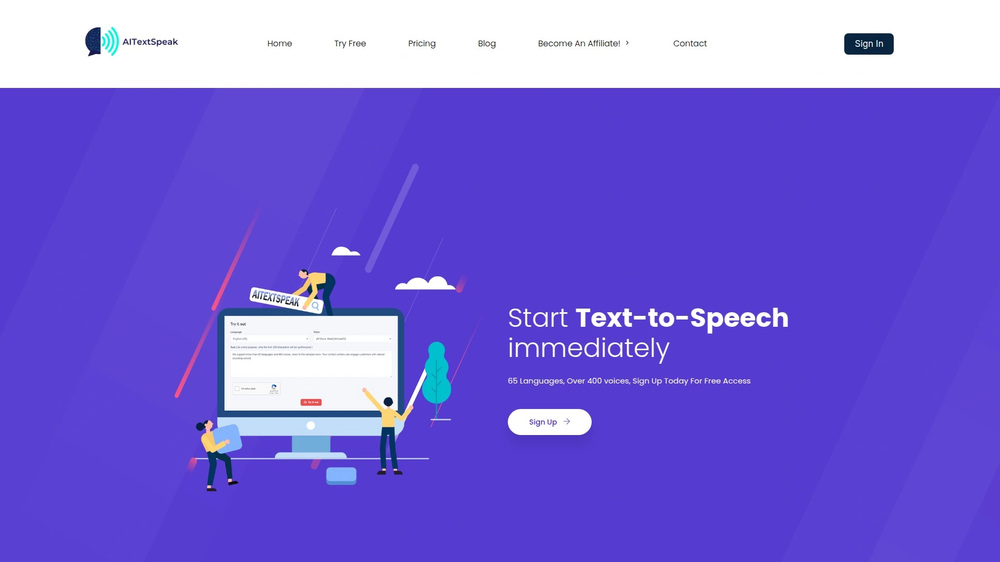

**Core functionality:**
* Provides a clean interface for pasting text and generating audio.
* Supports various languages and voice styles.
* A good entry-level option for basic text-to-speech needs.

## **[TTSReader](https://ttsreader.com)**

TTSReader is a free and simple online text-to-speech tool that works directly in your browser. It’s perfect for listening to articles, proofreading written content, or for users who need assistance with reading.

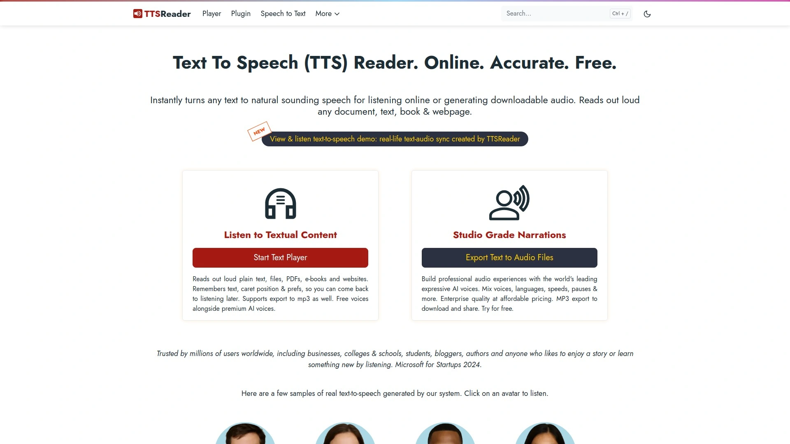

**Key features:**
* **No Installation Needed:** Just open the website, paste your text, and press play.
* Remembers its last position, so you can pick up where you left off.
* While it has plans for a more advanced program, its current free version is highly accessible and easy to use.

## FAQ

**How do I choose the best AI voice generator for my needs?**
First, consider your primary use case, such as video narration, podcasting, or accessibility. Then, look for platforms offering suitable voice styles, language support, and the level of customization you require.

**Can I use the generated voices for commercial projects like YouTube videos?**
Most platforms offer commercial rights with their paid subscription plans. However, it's crucial to always check the specific terms of service for the tool you choose to ensure you are in full compliance.

**What's the difference between standard and "ultra-realistic" AI voices?**
Ultra-realistic voices are created with newer AI models that generate much more human-like intonation, emotion, and pacing, making them sound far less robotic than older, traditional TTS technology.

## Conclusion

Finding the right AI voice generator can truly elevate your content, transforming it from something people just read to something they can experience. This list covers a wide range of powerful options for any project or budget. For those seeking a massive library of voices and languages with deep customization tools, **[Play.ht](https://play.ht)** is an excellent and powerful starting point for any creative endeavor.
